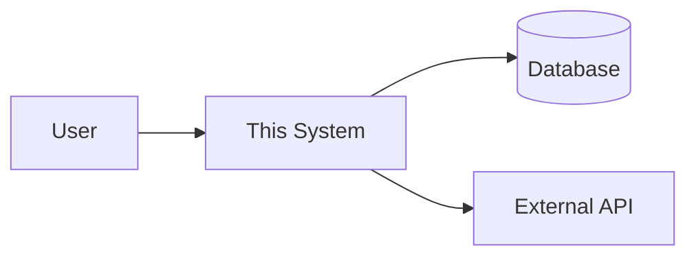

# 🏛 Architecture: `<project name>`

> Copy this template to `docs/code/ARCHITECTURE.md` and fill in. Delete
> sections that don't apply. Keep it under ~300 lines — anything longer
> belongs in design docs.

## 1. System context

What is this system? Who uses it? What does it talk to?
A single mermaid `flowchart` or `C4 Context` diagram is ideal here.

## 2. Top-level components

| Component | Path | Responsibility |
|---|---|---|
| Web | `src/web/` | HTTP entry point. |
| Core | `src/core/` | Pure domain logic; no I/O. |
| Storage | `src/storage/` | DB + cache. |

## 3. Data flow

Describe the happy-path request lifecycle. One paragraph + one diagram.

## 4. Cross-cutting concerns

- **Auth**: how identity flows through the system.
- **Logging**: format, sinks, redaction.
- **Errors**: classification (user / system / external) and propagation.
- **Config**: where it comes from and how it's loaded.

## 5. Invariants you must not break

- e.g. "All writes to `accounts.balance` go through `accounts.Update()`."
- e.g. "The cache is read-through; never write to the DB without invalidating."

## 6. Deployment topology

One paragraph: dev / staging / prod, how each piece runs.

## 7. Out of scope

What this system does NOT do, and why someone might wrongly assume it does.
