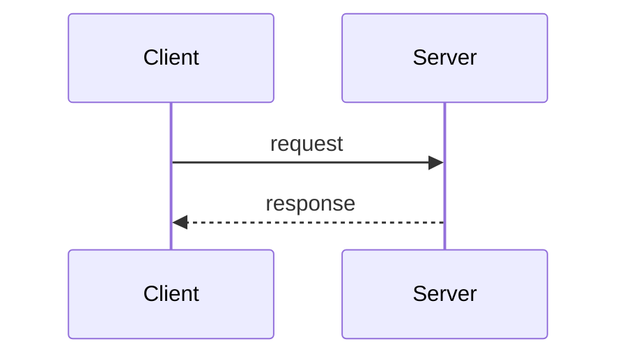

# 🎨 Design: `<topic>`

> Copy to `docs/design/DESIGN-<topic>.md`. Status drives whether reviewers
> can sign off. Keep under 2 pages.

- **Status**: draft | in-review | accepted | superseded
- **Author**: @you
- **Date**: YYYY-MM-DD
- **Supersedes**: (link or "none")

## Problem

What's broken or missing. One paragraph. Be concrete.

## Goals

- Bullet list of outcomes this design must achieve.

## Non-goals

- Bullet list of things this design explicitly will NOT address.

## Proposed design

The actual proposal. Diagrams welcome. Show data flow, schemas, error paths.

## Alternatives considered

For each alternative: one paragraph + why it was rejected.

## Migration / rollout

How we get from the current state to the new state. Reversible? Feature
flag? Big-bang? Backfill?

## Risks

What could go wrong, blast radius, mitigations.

## Open questions

Things still up for debate. Reviewer can answer them inline.
